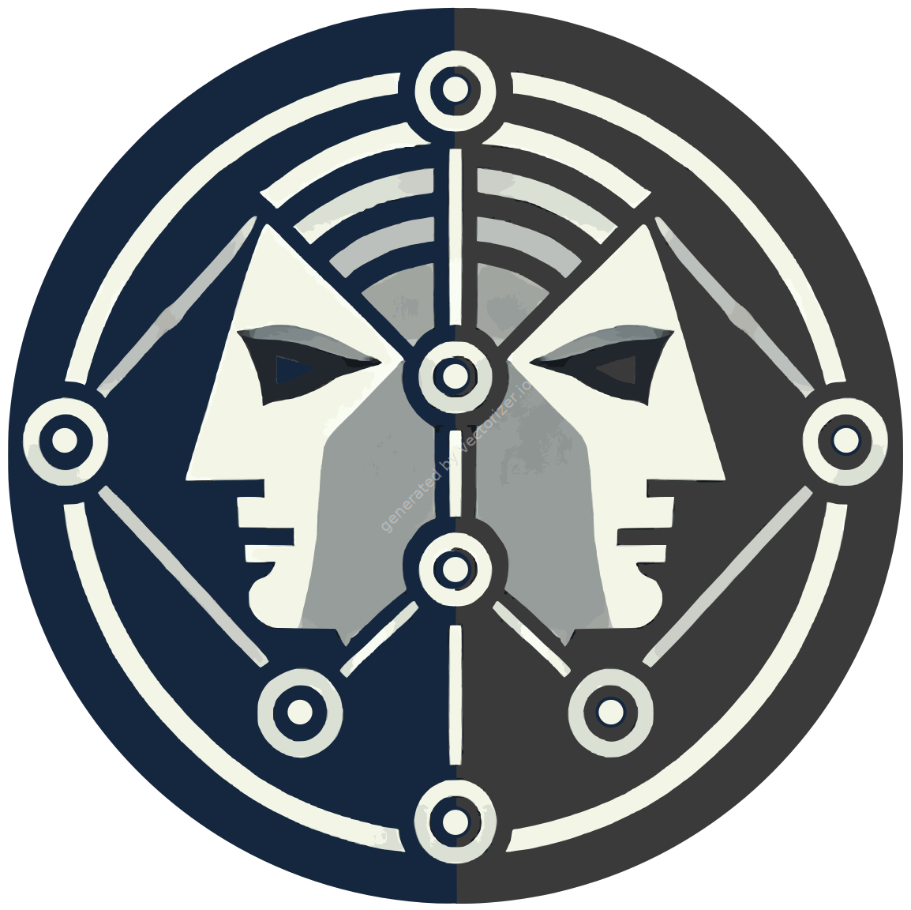

# JanuX
### See if it sticks

**Janus**, the Roman god of beginnings, transitions and duality, is known for his two faces. In Roman mythology, he symbolizes direction, beginnings, ends and contrasts.

---

**JanuX** is not a Roman god, but it is a robust yet simple tool for generating a set of path options in directed graphs. It is designed for efficient routing or creating path options for custom requirements.

---