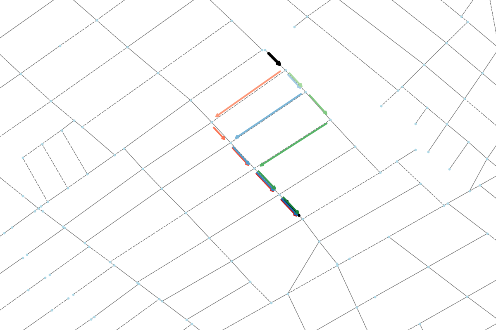

[](https://doi.org/10.5281/zenodo.17422815)


# JanuX


**Janus**, the Roman god of beginnings, transitions and duality, is known for his two faces. In Roman mythology, he symbolizes direction, beginnings, ends and contrasts.

---

**JanuX** is not a Roman god, but it is a robust yet simple tool for generating a set of path options in directed graphs. It is designed for efficient routing or creating path options for custom requirements.

---

## Examples

|  |  |
|------------------------|-----------------------|
|  |  |

---


---

## License

This project is licensed under the [MIT License](LICENSE.txt).

---

## Citation

If you use this repository, please cite it using the following BibTeX:

```bibtex
@software{JanuX,
  author = {Akman, Ahmet Onur},
  title = {{JanuX}},
  doi = {https://doi.org/10.5281/zenodo.17422816},
  url = {https://github.com/COeXISTENCE-PROJECT/JanuX},
  version = {1.0.1},
  month = oct,
  year = {2025}
}
